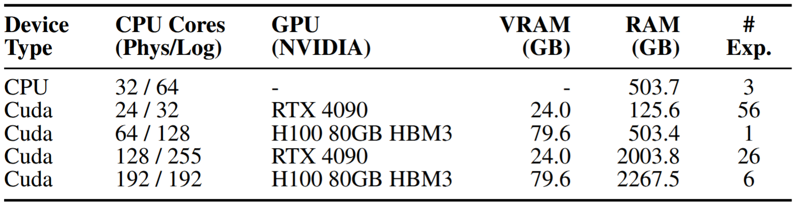
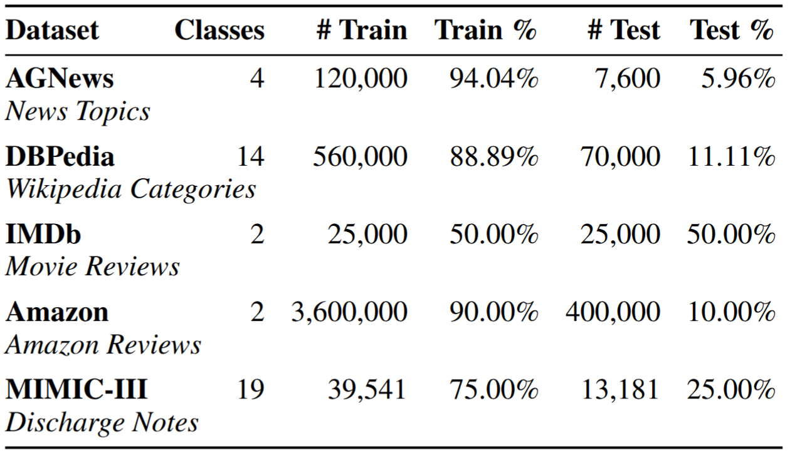
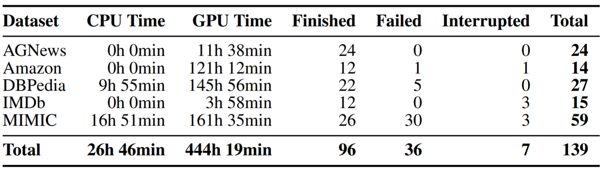
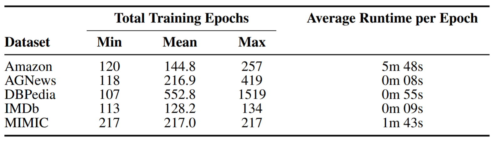
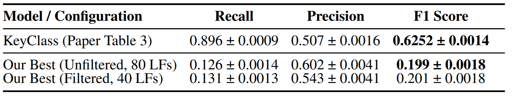
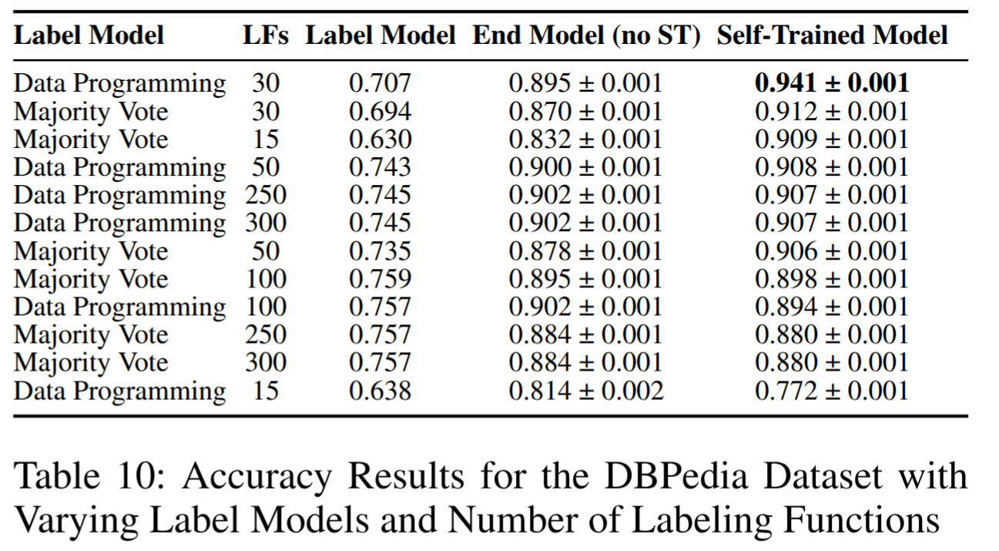

# Reproducibility Project - KeyClass: Text Classification with Label-Descriptions Only

This repository is an attempt at reproducing the paper [Classifying Unstructured Clinical Notes via Automatic Weak Supervision](https://arxiv.org/pdf/2206.12088) for the CS598 - Deep Learning for Healthcare at UIUC - Spring 2025. 

The original code for the paper was obtained from the authors' Github repository: https://github.com/autonlab/KeyClass

**This version includes modifications to attempt to support multi-label classification, for the MIMIC-III dataset, as described in the paper but not included in the original code repository.**

A video presentation of our results in available at [Illinois MediaSpace](https://mediaspace.illinois.edu/media/t/1_sqvnrd7z).

# 1. Repository Structure

## 1.1 Initial Folders and Files

- `config_files`: `.yaml` configuration files for each dataset. 
    - Includes `config_mimic_filtered_descriptions.yml` and `config_mimic_unfiltered_descriptions.yml` for MIMIC dataset.
- `keyclass`: original KeyClass implementation.
- `keyclass_multilabel`: adaptation for multi-label support.
- `mimic_preprocessing`: Pre-processing code to generate the MIMIC dataset and related files.
    - Scripts
        - `00_generate_icd9_descriptors.py`: Generates keyword descriptors for 19 top level ICD-9 categories.
            - Results included in the `.yml` configuration files for MIMIC at `/config_files`.
        - `01_create_admission_note_table.R`: Processes raw MIMIC CSVs (`NOTEEVENTS.csv` and `DIAGNOSES_ICD.csv`) and generates intermediate files.
            - Adapted from [FasTag's](https://github.com/rivas-lab/FasTag/blob/master/src/textPreprocessing/createAdmissionNoteTable.R) repository.
        - `02_generate_mimic_train_test_files.py`: Processes intermediate files and generates the final MIMIC dataset.
            - Dataset files: `train.txt`, `test.txt`, `train_labels.txt`, `test_labels.txt`, and `labels.txt`.
    - Folders
        - `mimic_csv_files/`: Directory where raw MIMIC CSVs should be placed.
        - `intermediate_files/`: Directory for intermediate files generated by the R script.
        - `output_mimic_files/`: Directory where the generated MIMIC dataset is saved.
    - Data Visualization
        - `mimic_data_visualization.ipynb`: data exploration notebook of the generated MIMIC dataset.
- `scripts`: Folder containing scripts for training runs and experiments.
    - `get_data.py`: Downloads the benchmark datasets, researchers' pre-trained models and their results.
    - `run_all.py`: Executes the training run and evaluation for original KeyClass implementation.
        - Calls `encode_datasets.py`, `label_data.py`, and `train_downstream_model.py`. 
    - `run_all_multilabel.py`: Executes the training run and evaluation for multi-label adaptation of KeyClass for MIMIC dataset.
        - Calls `encode_datasets_multilabel.py`, `label_data_multilabel.py`, and `train_downstream_model_multilabel.py`.
    - `run_experiments.py`: Runs multiple experiments for benchmark datasets.
        - Optional: can use Weights & Biases to log results and Dropbox to upload files.
    - `run_experiments_multilabel.py`: Runs multiple experiments for MIMIC dataset.
        - Optional: can use Weights & Biases to log results and Dropbox to upload files.
    - `dropbox_upload.py`: Helper script to upload files to Dropbox.
    
- `datasets_visualizations.ipynb`: data exploration notebook for the benchmark datasets (IMDB, Amazon, AGNews, DBPedia).
- `experiment_summary.csv`: compilation of the results of our experiments.
- `experiment_summary.ipynb`: notebook for visualizing our experiment results.

## 1.2 Folders Generated By Scripts (Upon Execution)

- `original_data`: Stores the datasets.
    - Created when `scripts/get_data.py` is executed to download the datasets.
    - A subfolder for each dataset `imdb`, `amazon`, `dbpedia`, `agnews`, and `mimic`.
- `pretrained_models`: Stores the pre-trained models provided by the researchers for benchmark datasets.
    - Created when `scripts/get_data.py` is executed to download the pre-trained models.
- `results`: Results for each training run (one folder for each run).
    - Created when `scripts/run_all.py` or `scripts/run_all_multilabel.py` is executed.
    - For each training run, creates subfolders `/embeddings`, `/metrics`, and `/models`.
- `logs`: Stores the `.log` file for each training run.
    - Created when `scripts/run_all.py` or `scripts/run_all_multilabel.py` is executed.
- `results_csv`: Stores CSV files for experiment details and results.
    - Created when `scripts/run_experiments.py` or `scripts/run_experiments_multilabel.py` is executed.

## 1.3 Other Files

- `pyproject.toml`: Project configuration file used by `uv` python package manager.
- `README.md`: this README file.
- `assets`: images used in this README file.

# 2. Requirements

## 2.1 Hardware Requirements

The project utilized multiple Linux machines depending on the dataset, as listed below.



Most experiments will be able to run on a 32-core CPU, an RTX 4090 GPU 24GB, and at least 128GB of RAM.

For some training runs with DBPedia, Amazon, and MIMIC, better GPUs or running directly on CPU will be required.

## 2.2 Environment Setup

First, have **CUDA 12.4+**  installed on the system. A guideline is available on the [Nvidia website](https://developer.nvidia.com/cuda-12-4-0-download-archive). 

Install the `uv` python package manager, available at https://github.com/astral-sh/uv.

On Debian/Ubuntu, run this command to install the dependencies to compile the `slycot` package and to run R scripts (required for MIMIC dataset preprocessing):
``` shell
sudo apt install gfortran liblapack-dev libopenblas-dev
sudo apt install r-base r-base-dev
sudo apt install r-cran-stringr r-cran-data.table r-cran-dplyr r-cran-lubridate r-cran-caret r-cran-tibble
```
*(Note: If you encounter issues installing R packages via apt, you might need to install them within R itself using `install.packages(c("stringr", "data.table", ...))`)*

After the previous command completes, **within the project folder**, run:

- `source .venv/bin/activate` to activate the project's virtual environment.
- `uv sync` to install the necessary python packages. 

*If you want to use another python environment (conda or pip), the necessary packages are listed in the `pyproject.toml` file.*

In addition, this project supports [Weights & Biases](https://wandb.ai/) for model training tracking. If you want to use this feature, please first create your account and authenticate with the API key using `uvx wandb login`.

## 2.3 Getting the Benchmark Datasets, Original Models, and Results

To download the **benchmark datasets** (IMDb, Amazon, AGNews, and DBPedia), researchers' pre-trained models (for benchmarks), and results (for benchmarks), run this command:
```shell
cd scripts # Must be in the scripts folder 
uv run get_data.py
``` 

The script will ask for confirmation before dowloading each file. 

**Attention**: this script will **not** provide the MIMIC-3 dataset.

## 2.4 MIMIC-3 Dataset Preprocessing

KeyClass requires specific files from the MIMIC-III database to be preprocessed into a custom dataset before running experiments.

**Steps:**

1.**Obtain MIMIC-III**: Obtain the MIMIC-III Clinical Database (v1.4 or compatible) through the official process at [PhysioNET](https://mimic.physionet.org/).

2.**Place Raw Files**: Copy the `DIAGNOSES_ICD.csv` and `NOTEEVENTS.csv` files from the MIMIC-III dataset into the `mimic_preprocessing/mimic_csv_files/` directory.

3.**Generate ICD-9 Descriptors (optional)**: Our generated descriptors are already included in the `/config_files/config_mimic_unfiltered.yml` and `/config_files/config_mimic_filtered.yml`. 

However, if you want to manually generate them, run the following script:
```shell
cd mimic_preprocessing # Navigate to the preprocessing directory
# This will output the top 30 keywords per ICD-9 top-level category 
# and save the results to target_icd9_descriptors.txt
uv run 00_generate_icd9_descriptors.py --num_keywords_per_cat 30 --output_file target_icd9_descriptors.txt 
```
The script also accepts filtering common keywords that are common in over % percentage of the categories.

In the `config_mimic_filtered.yml` we used the top 30 keywords per category after removing common keywords that were shared in over 30% of the 19 categories. 

The list was generated with this command:
```shell
cd mimic_preprocessing # Navigate to the preprocessing directory
uv run 00_generate_icd9_descriptors.py --num_keywords_per_cat 30 --shared_keyword_threshold 30 --output_file target_icd9_descriptors_filtered.txt
```
4.**Run R Script**: Execute the R script to process the raw MIMIC-III CSV files (`DIAGNOSES_ICD.csv` and `NOTEEVENTS.csv`) and create intermediate files. 

The script filters discharge notes, extracts the associated ICD-9 codes, maps these codes to top-level categories, and splits the data into training and testing sets.
```shell
cd mimic_preprocessing # Navigate to the preprocessing directory
Rscript 01_create_admission_note_table.R
```
This will generate `icd9NotesDataTable_train.csv` and `icd9NotesDataTable_test.csv` in the `mimic_preprocessing/intermediate_files/` directory.

**Credit**: Adapted from the original script from [FasTag's](https://github.com/rivas-lab/FasTag/tree/master/src/textPreprocessing) Github repository [(Venkataraman et al. (2020)](https://doi.org/10.1371/journal.pone.0234647). Adapted for the current project.

5.**Data Analysis & Visualizations (optional)**: We provide an Jupyter notebook that explores the files generated on step 3. To start Jupyter/JupyterLab on the project folder, run the following command:
```shell
uv run --with jupyter jupyter lab
```
Open the web link on your browser and navigate to `/mimic_preprocessing/mimic_data_visualization.ipynb`.

6.**Run Python Script**: Execute the Python script to convert the intermediate files into the final format required by the KeyClass pipeline.
```shell
cd mimic_preprocessing # Navigate to the preprocessing directory
uv run 02_generate_mimic_train_test_files.py
```
This will create the following files in the `mimic_preprocessing/output_mimic_files/` directory:
- `train.txt`: Training clinical notes (one per line).
- `test.txt`: Testing clinical notes (one per line).
- `train_labels.txt`: Multi-hot encoded labels for training data (e.g., "010...1").
- `test_labels.txt`: Multi-hot encoded labels for testing data.
- `labels.txt`: Names of the 19 top-level ICD-9 categories.

7.**Copy Output Files**: Copy the output files from the `mimic_preprocessing/output_mimic_files/mimic` to `../original_data/mimic` folder using these commands.
```shell
# Creates the folder if it does not exist
mkdir -p ../original_data/mimic
# Copies generated files to the folder 
# Will ask for confirmation if overwriting
cp -ir output_mimic_files/mimic/* ../original_data/mimic/
```

# 3. Training and Evaluation

## 3.1 Configuration Files

The main parameters for each training run can be configured using the provided `.yml` files at `/config_files`.

We've provided the original configuration files for each dataset according to the hyperparameters used in the KeyClass paper.

However, the original KeyClass repository does not provide a configuration file for the MIMIC-derived dataset. As a result, experiments were performed using a custom file that retained the paper's reported hyperparameters and those common among the datasets. 

To create a custom configuration just clone one of the files and save it with a new name, changing the desired parameters.

## 3.2 Executing a Training Run

To train and evaluate a single model, first choose a `.yaml` configuration file (e.g., `config_imdb.yml` for IMDb or `config_mimic_unfiltered_descriptions.yml` for MIMIC-III after preprocessing).

### 3.1 Single-Label Datasets (IMDB, AGNews, Amazon, DBPedia)

``` shell
cd scripts # Need to be in the /scripts folder 

# Use run_all.py for single-label datasets
# Example for IMDB
# if Weights & Biases is set up
uv run run_all.py --config ../config_files/config_imdb.yml --use_wandb 1 
# if not using Weight & Biases
uv run run_all.py --config ../config_files/config_imdb.yml --use_wandb 0 
```

### 3.2 Multi-Label Dataset (MIMIC)

``` shell
# Example for MIMIC-III (ensure preprocessing is done first):
# if Weights & Biases is set up
uv run run_all_multilabel_.py --config ../config_files/config_mimic_unfiltered_descriptions.yml --use_wandb 1
# if not using Weight & Biases
uv run run_all_multilabel.py --config ../config_files/config_mimic_unfiltered_descriptions.yml --use_wandb 0
```

### 3.3 Training Output Files

The scripts will create a **unique experiment name** for the training run, that will be shown at the start.

Generated files will be inside the folder `/results/[dataset]/[experimentname]`:
- `/data_embeddings`: Embedded dataset files.
- `/metrics/`: Metrics for the models.
    - `train_label_model_with_ground_truth.txt`: Metrics for label model.
    - `test_end_model_with_ground_truth.txt`: Metrics for downstream classifier model.
    - `test_end_model_with_ground_truth_self_trained.txt`: Metrics for downstream self-trained model.
    - `test_end_model_with_ground_truth_category_specific_by_category.json`: Category-specific F1 scores (only for MIMIC).
- `/models`: Generated models (downstream classifier and self-trained model).
- `/predictions`: Pickle files with the models' predictions.

The log file for the training run will be saved at `/logs/[experimentname].log`.

# 4. Executing Multiple Training Runs with Different Hyperparameters

To facilitate **executing multiple training runs automatically** with **different hyperparameters**, we've developed the following scripts:
- `run_experiments.py`: Executes training runs for benchmark datasets (single-label).
- `run_experiments_multilabel.py`: Executes training runs for MIMIC dataset (multi-label).

Modify the following variables at the start of each script:
- `EXPERIMENT_CSV_PREFIX`: Prefix of the CSV filename that will store the results.
- `DATASETS`: Array with the list of datasets to be tested.
- `LEARNING RATE`: Array with the end model learning rates to be tested per dataset.
- `BATCH_SIZE`: Array with the end model batch sizes to be tested per dataset.
- `LABEL_MODELS`: Array with the label models to be tested per dataset.
- `LABELING_FUNCTIONS`: Array with the number of labeling functions to be tested per dataset.
- `NGRAM_RANGE`: Array with the n-gram range to be tested (only for `run_experiment_multilabel.py`).
- `DATASET_DETAIL`: Array with the type of descriptors to use (only for `run_experiment_multilabel.py`).

Additionally, you can pass the following optional command-line parameters:
- `--use_wandb`: If you want to use Weights & Biases to log each experiment.
- `--keep_configs`: If you want to keep the temporary `.yml` configuration file generated for each experiment.
    - These will be stored in the `/config_files` folder with the structure `temp_config_[experimentname].yml`.
- `--use_dropbox`: If you want to upload the resulting files to Dropbox after each experiment.
    - Please add your credentials in `dropbox_upload.py` if you want to use this feature.

Example:
```shell
cd scripts # Need to be in the /scripts folder 

# Will execute experiments for the benchmark datasets
# Will logs runs and keep temporary .yml config files
# Will save resulting files to Dropbox
uv run run_experiments.py --use_wandb --keep_configs --use_dropbox

# Will execute experiments for the MIMIC dataset
# Will logs runs and keep temporary .yml config files
# Will save resulting files to Dropbox
uv run run_experiments_multilabel.py --use_wandb --keep_configs --use_dropbox
```

# 5. Evaluation

The paper used the following evalution metrics:
 - **Benchmark Datasets**: Accuracy, precision, and recall.
 - **MIMIC-derived Dataset**: Aggregate F1 Score, precision, and recall.

Model evaluation is performed **automatically at the end of each training run** in `run_all.py` or `run_all_multilabel.py`.

Results are saved in the corresponding `/results/[dataset]/[experiment_name]/metrics/` directory and logged to `.log` file (and Weights & Biases if enabled).

# 6. Pre-trained Models

## 6.1 Original KeyClass Pre-Trained Models

You can download the original KeyClass pretrained models **for the benchmark datasets** using the `scripts/get_data.py` script (see Section 2.3).

## 6.2 Our Pre-Trained Models (Reproducibility Study)

Files generated by each training run, including the models, are available at our [Dropbox folder](https://www.dropbox.com/scl/fo/7xpliie7wpnqc677t2cwa/AK4IGXkCmLn-1UTFUWHSHpQ?rlkey=sq7ytrn04k2p953gj29hi771g&st=g9jhwp98&dl=0).

# 7. Results (Reproducibility Study)

This reproducibility study performed a total of 139 experiments for the five datasets.

Files generated by each training run, including evaluation metrics, are available at our [Dropbox folder](https://www.dropbox.com/scl/fo/7xpliie7wpnqc677t2cwa/AK4IGXkCmLn-1UTFUWHSHpQ?rlkey=sq7ytrn04k2p953gj29hi771g&st=g9jhwp98&dl=0).

We also provide a compilation of all experiments data and results, including evaluation metrics, in the `experiment_summary.csv` file and this [Google Sheet](https://docs.google.com/spreadsheets/d/1eHx2QmqcPsGohQ6mkNt-vAasfkkUmOfar1KnJM2FNjc/edit?usp=sharing).

In addition, all training runs were logged and are available at [Weights & Biases](https://wandb.ai/fb8-university-of-illinois-urbana-champaign/dl4h-reproduce-keyclass/table).

## 7.1 Training Statistics

### 7.1.1 Datasets



Dataset Statistics from Gao et al. (2022). Models were trained on the training set, but do not have access to labels. Unlike other datasets, MIMIC is a multi-label classification task where each clinical note is assigned to all relevant categories. All datasets, except MIMIC, are balanced.

### 7.1.2 Computational Requirements


Hardware Configurations and Number of Completed Experiments per Configuration.



Compute Hours and Experiment Status per Dataset.



Training Epochs (label model, downstream classifier and self-trained model) and Average Runtime.

## 7.2 Results - Benchmark Datasets (Single-Label)


The performance on the four benchmark datasets was evaluated based on *accuracy*, comparing the label, downstream classifier, and self-trained models against the values reported in Tables 5 and 6 of the paper.

**Discussion of Benchmark Results:**

- **AGNews & IMDb:**  
  Results for the self-trained model were close to the paper's Table 6 values (within `0.003` and `0.010` absolute difference, respectively), suggesting successful reproduction with the paper's default settings. Label model accuracies also closely matched. The downstream end model (without self-training) showed slightly lower accuracy for AGNews (`-0.012`) and slightly higher for IMDb (`+0.008`) compared to the paper.

- **Amazon:**  
  Label model performance (`0.727` for data programming, `0.719` for majority vote) was *higher* than reported results (`0.580`, `0.652`). Consequently, the downstream classifier model also performed better (`0.858` vs. `0.832` for data programming). However, the self-trained model accuracy (`0.918`) was slightly *lower* than the paper's Table 6 result (`0.941`), but close to results on Table 5 (`0.928`). The reasons for label model discrepancy might relate to subtle differences in keyword extraction.

- **DBPedia:**  
  This dataset showed the largest discrepancy. Using the paper's stated `15` labeling functions, the self-trained model accuracy (`0.772`) was substantially *lower* than the reported results (`0.951`, `0.940`). Label model accuracies were *identical*, and the downstream model was only slightly lower (`0.814` vs. `0.823`). As explored in our extensions/ablations, increasing the labeling functions to `30` improved the accuracy significantly (to `0.941`), suggesting possible use of more functions than stated. In fact, the `.yml` DBPedia configuration file ([available here](https://github.com/autonlab/KeyClass/blob/main/config_files/config_dbpedia.yml)) provided by the authors explicitly uses `37` labeling functions.

Overall, results were largely reproducible for AGNews and IMDb, with some discrepancies for Amazon and DBPedia.

## 7.3 Results - MIMIC-derived Dataset (Multi-Label)



Reproducing the MIMIC-derived dataset results required adapting the source code for multi-label classification and inferring missing hyperparameters. The table below compares the best results achieved in this study with the paper's Table 3.

**Discussion of MIMIC-III Results:**

Results indicate that the MIMIC-III multi-label classification task was **not successfully reproduced**.  
Our best F1 score with unfiltered class descriptions (`0.199`) is significantly *lower* than the paper's reported F1 score (`0.625`).

- **Recall:** Our models achieved much lower recall (`0.126` and `0.131`) compared to the paper's `0.896`.
- **Precision:** Our models achieved higher precision (`0.602` and `0.543`) compared to the paper's `0.507`.
- **F1 Score:** This resulted in a drastically lower F1 score.

**The discrepancies are likely due to a combination of factors:**

- **Lack of Original Multi-Label Code:**   The adaptations made might have been suboptimal or contained errors compared to the authors' implementation.

- **Missing Preprocessing Details:** The paper used TF-IDF to rank relevant parts of each discharge note but did not detail how it was applied nor provide the source code.   This reproduction used the full text of each note, introducing more noise in the keyword/key-phrase acquisition stage, which may have affected model performance.

- **Unspecified Hyperparameters:** Key hyperparameters like the number of labeling functions and n-gram range for the MIMIC-derived dataset were not provided. While different combinations were tested, the optimal combination used by the authors remains unknown.

- **Class Descriptions:** The exact keyword set might differ slightly, and the number of keywords per ICD-9 top-level class was *not* informed. Experiments with filtered keywords provided marginal improvement (`0.199` to `0.201`).

## 7.4 Results - Ablation 1 - Decreasing the Downstream Classfier End Model Learning Rate and Batch Size

Experiments were conducted varying the downstream model learning rate (LR) (`1e-3` vs. `1e-4`) and batch size (`128`, `64`, `32`) for the benchmark datasets, using both data programming (KeyClass's default) and majority vote for the label model.  


**General Trend:** Reducing the batch size often led to slightly better accuracy, especially for IMDb and AGNews datasets when using the default LR=`1e-3`. The default LR=`1e-3` generally outperformed `1e-4`, except for DBPedia at larger batch sizes (`128` and `64`).

**Best Configurations (Self-Trained Model Accuracy):**

**AGNews** 
  - Best accuracy (`0.874`) achieved with LR=`1e-3`, batch size `32`, and **data programming**, *surpassing* the paper's best reported accuracy.

**DBPedia** 
- Best accuracy (`0.931`) with LR=`1e-4`, batch size `64`, and *majority voting*, surpassing data programming (which peaked at `0.856` with LR=`1e-3` and batch size `32`). This approaches the paper’s reported result.

**IMDb** 
- Best accuracy (`0.922`) achieved with LR=`1e-3`, batch size `32`, and **data programming**. 
- *Majority voting* achieved the same score with LR=`1e-4` and batch size `32`. 
- Both configurations *surpassed* the paper's reported accuracy.

**Amazon**
- Best accuracy (`0.927`) with LR=`1e-3`, batch size `64`, and **data programming**, *within margin of error* of the paper’s Table 5 result (`0.928`).

**Conclusion**
- The paper's hyperparameters (LR=`1e-3`, batch size `128`) were reasonable. 
- However, smaller batch sizes (`32` or `64`) consistently yielded better accuracy across datasets.
- A lower learning rate (`1e-4`) did not consistently outperform the default setting.

## 7.5 - Results - Ablation 2 - Increasing Number of Labeling Functions for DBPedia Dataset

Experiments were run with an end model learning rate of `1e-3`, batch size of `128` (the paper's default), and a varying number of labeling functions (LFs): `15`, `30`, `50`, `100`, `250`, and `300`.



**Data Programming**  
  - Accuracy initially improved significantly, peaking at `0.941 ± 0.001` with `30` LFs (up from `0.772` at `15` LFs), closely matching the paper's Table 5 score of `0.940 ± 0.001`.  
  - Beyond `30` LFs, performance slightly decreased and plateaued around `0.900–0.908`.  
  - Hence, the theoretical claim mentioned in the paper — that data programming benefits from more labeling functions — was only *partially confirmed* for the DBPedia dataset.

**Majority Vote**  
  - Accuracy improved with more labeling functions at first, peaking at **`0.912 ± 0.001`** with `30` LFs and `0.909 ± 0.001` with `15` LFs.  
  - Performance degraded slightly at higher LF counts (`50`, `100`, `250`, `300`).  
  - Majority voting performed better than data programming at `15` LFs (`0.909` vs. `0.772`), but worse than data programming at the peak of `30` LFs (`0.912` vs. `0.941`).

**Conclusion**  
  - Increasing the number of labeling functions from the paper’s stated `15` significantly improved the accuracy of the self-trained model, matching the paper's Table 5 result at `30` LFs using data programming.  
  - Further increases in LF count did *not* help and occasionally *harmed* model performance.

# 8. License and Contributing 

MIT License

Permission is hereby granted, free of charge, to any person obtaining a copy of this software and associated documentation files (the "Software"), to deal in the Software without restriction, including without limitation the rights to use, copy, modify, merge, publish, distribute, sublicense, and/or sell copies of the Software, and to permit persons to whom the Software is furnished to do so, subject to the following conditions:

The above copyright notice and this permission notice shall be included in all copies or substantial portions of the Software.

THE SOFTWARE IS PROVIDED "AS IS", WITHOUT WARRANTY OF ANY KIND, EXPRESS OR IMPLIED, INCLUDING BUT NOT LIMITED TO THE WARRANTIES OF MERCHANTABILITY, FITNESS FOR A PARTICULAR PURPOSE AND NONINFRINGEMENT. IN NO EVENT SHALL THE AUTHORS OR COPYRIGHT HOLDERS BE LIABLE FOR ANY CLAIM, DAMAGES OR OTHER LIABILITY, WHETHER IN AN ACTION OF CONTRACT, TORT OR OTHERWISE, ARISING FROM, OUT OF OR IN CONNECTION WITH THE SOFTWARE OR THE USE OR OTHER DEALINGS IN THE SOFTWARE.

See [MIT LICENSE](https://github.com/autonlab/KeyClass/blob/main/LICENSE) in the original repository for details.

# 9. References

Gao, C.; Goswami, M.; Chen, J.; and Dubrawski, A. 2022. Classifying Unstructured Clinical Notes via Auto-
matic Weak Supervision. In Lipton, Z.; Ranganath, R.; Sendak, M.; Sjoding, M.; and Yeung, S., eds., *Proceedings of the 7th Machine Learning for Healthcare Conference*, volume 182 of *Proceedings of Machine Learning Research*, 673–690. PMLR.

Venkataraman, G. R.; Pineda, A. L.; Bear Don’t Walk IV, O. J.; Zehnder, A. M.; Ayyar, S.; Page, R. L.; Bustamante,C. D.; and Rivas, M. A. 2020. FasTag: Automatic text classification of unstructured medical narratives. PLoS one, 15(6):e0234647.
